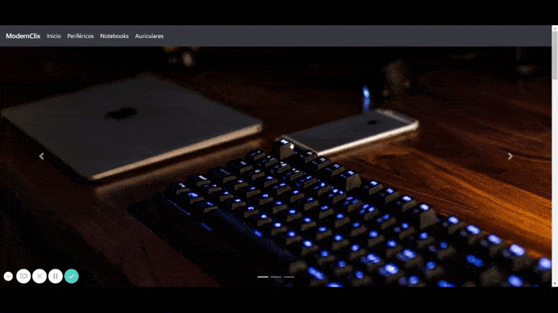

# React - Ecommerce - Gastón Aragón.

Consiste en un simulador de ecommerce realizado en React, con el fin de ser presentado como proyecto final del curso de React de Coderhouse.

## GIF de demostración.



## Link del deploy.

https://coder-react.vercel.app/

## Instalación
1. Clonar el repositorio
   ```bash
   git clone https://github.com/gaston-ara/coder-react
   ```
2. Instalar modulos de Node
   ```bash
    npm install
   ```
3. Ejecutar el servidor local   
    ```bash
    npm start
    ```
    
Abrir [http://localhost:3000](http://localhost:3000) en el navegador para ver los resultados.

## Librerias utilizadas

[SASS](https://sass-lang.com/): Se utilizó para organizar los estilos dividiendolos por cada componente.

[React Bootstrap](https://react-bootstrap.github.io/): Se utilizó para facilitar el diseño responsive y para desarrollar el carrusel.